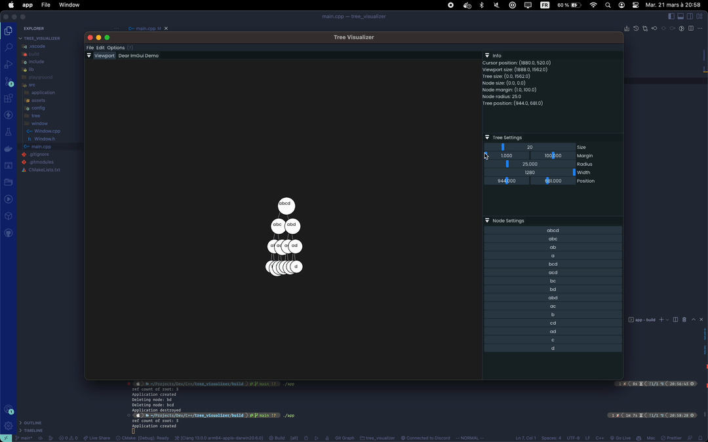

# Tree Visualizer

This is a tree visualizer developed using C++ and ImGui with SFML. The project allows users to visualize and manipulate binary trees. Users can navigate through the tree using the arrow keys or by right-clicking on a node to access a contextual menu.

## Features

- View binary tree structure
- Traverse through the tree using arrow keys or contextual menu
- Broken Rotate button (supposed to rotate the current node in the fashion of an AVL tree)

## Demo



## How to Use

1. Launch the binary file generated by compiling the code.
2. Use the arrow keys or right-click on a node to access the contextual menu.
3. Navigate the tree by selecting the appropriate option in the contextual menu.
4. Use the Rotate button to rotate the current node (currently not functioning as intended).

## Compiling

To compile the project, navigate to the project root directory and run the following commands:

```bash
mkdir build
cd build
cmake ..
make
```

## Dependencies

- SFML
- ImGui
- CMake

## Notes

I would like to redo this project in the future using a different language and framework. I would also like to add more features to the project such as the ability to support multiple trees and the ability to sort the tree.
My dream is to run this project through the command line with parameters to specify the tree structure to use and then have the program output the tree.

### Example

```bash
./tree-visualizer -t avl -i 1,2,3,4,5,6,7,8,9,10
```
